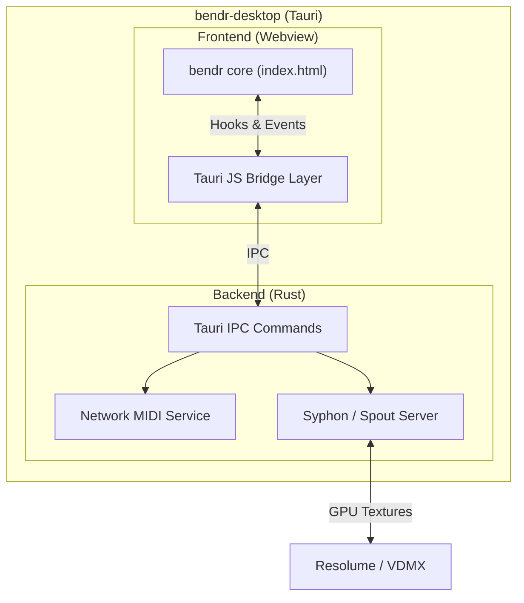

# BENDR Desktop Architecture

## How it Builds on the Baseline

The core of `bendr` is designed around a strict **zero-dependency philosophy**. It is a single-file HTML app that can run fully offline, ensuring maximum portability, immunity to "npm rot", and long-term stability. It runs entirely inside the browser's sandbox.

However, professional live visual environments demand capabilities that browsers explicitly block:
- **Zero-copy GPU texture sharing** (Syphon on macOS, Spout on Windows) to feed other VJ software like Resolume or TouchDesigner.
- **Network protocols** (OSC, RTP-MIDI, NDI) to communicate with external hardware and software.

`bendr-desktop` bridges this gap using **Tauri v2**. It wraps the pristine `bendr` core in a native desktop shell, injecting capabilities from the outside in.

### The Integration Pattern

We do not modify the core `index.html`. Instead, `bendr-desktop` uses a **Git Submodule** to pull in the upstream `bendr` repository. During the build process (`build.js`), we inject a thin Javascript shim (`bridge.js`) just before the closing `</body>` tag.

This pattern means:
1. **Upstream remains clean:** The core `bendr` repo never learns about Tauri, Rust, or npm.
2. **Effortless updates:** Pulling in new `bendr` features is as simple as updating the git submodule.
3. **Graceful degradation:** If `bendr-desktop`'s bridge fails, the core app continues to function exactly as it would in a normal browser.

### Bridging the Gap: Syphon & Spout

In the browser, extracting video frames requires `readPixels()` or `canvas.toDataURL()`, which incurs a massive CPU roundtrip penalty. In `bendr-desktop`, we bypass WKWebView's internal rendering isolation using **local WebRTC loopback** and optimized IPC to stream textures into a native Rust process.

For Syphon/Spout specifically:
- **macOS (Syphon):** We use `syphon-rs` to publish the WebGL output frame as an IOSurface.
- **Windows (Spout):** We use `spout2-rs` to share DirectX/OpenGL textures.

By keeping these complex FFI bindings and GPU memory interactions in Rust, we maintain the safety and performance required for live VJ setups, while the UI and video synthesis logic remain happily sandboxed in JS/WebGL.

### Multi-Monitor Borderless Output
WKWebView isolates pop-up windows, breaking `bendr`'s native dual-monitor capability. `bendr-desktop` intercepts the POP OUT button (`#btnPop`) and replaces it with a custom native display selector UI. When a display is selected, we launch a secondary borderless Tauri window on that exact monitor. To bypass WebGL context sharing limitations, the primary window streams its output via a local `RTCPeerConnection` (WebRTC) to the output window at 60fps.

### Zero-Copy Native Publishers (Syphon & NDI)
A background publisher built into the Tauri Rust core intercepts frames from the WebRTC output stream and publishes them to professional VJ tools.
- **macOS (Syphon)**: Uses `objc2-metal` to upload the raw Javascript `Uint8Array` directly to an `MTLTexture` via an `MTLCommandQueue`, avoiding CPU overhead.
- **NDI 6 (Cross-Platform)**: Dynamically loads `libndi.dylib` / `.dll` at runtime via `libloading` and raw `ndi-sdk` FFI. Completely avoids static proprietary C++ linkage, disabling itself gracefully if the user lacks the NDI runtime.

### Native MIDI, RTP-MIDI, and OSC Services
Tauri's Rust backend connects to OS-level inputs and pipes data into `bendr` via synthetic Javascript events:
- **Local USB MIDI**: Connects natively via the `midir` crate.
- **RTP-MIDI (AppleMIDI / mDNS)**: Uses the `rtpmidi` crate to broadcast `BENDR Desktop` via mDNS (UDP 5004). Auto-accepts incoming connections from iPads/TouchOSC and pipes them into the frontend exactly like local MIDI, removing the need for manual macOS Audio MIDI Setup routing.
- **Open Sound Control (OSC)**: Runs a background `rosc` UDP server on port 8000. Translates paths like `/bendr/cc/<n>` and `/bendr/note/<n>` into synthetic MIDI events inside `bridge.js`, instantly unlocking `bendr`'s native MIDI Learn tool for OSC sources.
